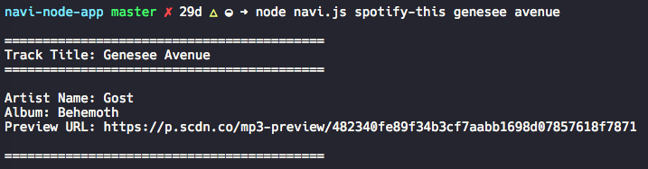
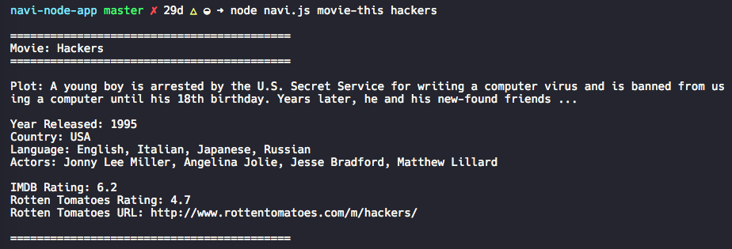

# NAVI Node App

NAVI is like iPhone's SIRI. However, while SIRI is a Speech Interpretation and Recognition Interface, NAVI is a *Language* Interpretation and Recognition Interface. NAVI is a command line node app that takes in parameters and gives back data.

## Available Commands
* `latest-tweets`
* `spotify-this`
* `movie-this`
* `do-what-it-says`

## What Each Command Will Do
1. `node navi.js latest tweets`
		
	* This will show your last 20 tweets and when they were created at in your terminal/bash window.
  
  `node navi.js my-tweets '<Twitter username here>'`
  
  * This will show the last 20 tweets of the Twitter username entered in your terminal/bash window.

2. `node navi.js spotify-this '<song name here>'`

	* This will show the following information about the song in your terminal/bash window.
		* Artist(s)
		* The song's name
		* A preview link of the song from Spotify
		* The album that the song is from

	* If no song name is provided, Navi will default to
		* "The Sign" by Ace of Base

3. `node navi.js movie-this '<movie name here>'`

	* This will output the following information to your terminal/bash window:

		* Title of the movie.
		* Year the movie came out.
		* IMDB Rating of the movie.
		* Country where the movie was produced.
		* Language of the movie.
		* Plot of the movie.
		* Actors in the movie.
		* Rotten Tomatoes Rating.
		* Rotten Tomatoes URL.

	* If no movie name is provided, Navi will output data for the movie 'Mr. Nobody.'
		* If you haven't watched "Mr. Nobody," then you should: http://www.imdb.com/title/tt0485947/
		* It's on Netflix!

4. `node navi.js do-what-it-says`
	* Using the `fs` Node package, Navi will take the text inside of random.txt and then use it to call the specified command, `spotify-this "I Want it That Way"`
		* Feel free to change the text in random.txt to test out the feature for other commands.

### Twitter Functionality

To use the `node latest-tweets` command, you will need a keys.js file and your Twitter API Keys.

1. Create a file named `keys.js` in the app's root directory.

  Inside your keys.js insert the following:

  ``` JavaScript
  console.log('this is loaded');

  exports.twitterKeys = {
    consumer_key: '<input here>',
    consumer_secret: '<input here>',
    access_token_key: '<input here>',
    access_token_secret: '<input here>',
  }

  ```

2. Get your Twitter API keys by following these steps:

  * Step One: Visit https://apps.twitter.com/app/new
  * Step Two: Fill out the form with dummy data. Type `http://google.com` in the Website input. Don't fill out the Callback URL input. Then submit the form.
  * Step Three: On the next screen, click the Keys and Access Tokens tab to get your consume key and secret. 
    * Copy and paste them where the `<input here>` tags are inside your keys.js file.
  * Step Four: At the bottom of the page, click the `Create my access token` button to get your access token key and secret. 
    * Copy the access token key and secret displayed at the bottom of the next screen. Paste them where the `<input here>` tags are inside your keys.js file.
    
## Example Output

### Spotify


### OMDB

